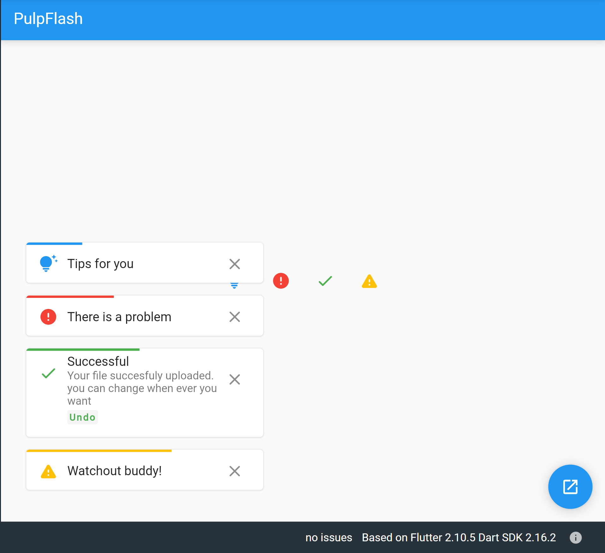

Simple multipurpse flashes to announce different messages to the user and interact with them.
Display multiple flashes at the same time and avoid writing thousands of extra lines to handle different situations of your application.

## Features

- Display multiple messages
- Pinned Message
- Customizable statuses
- Customizable display duration for each message




> More features coming. it's will be a pleasure to report any bug or features that you think help the package💖. [Repository (GitHub)](https://github.com/HassanEm/pulp_flash)


## Usage

You just need to set a `ChangeNotifierProvider<PulpFlash>` (I recommend putting it above of `MaterialApp`, its helps you not worried about contexts and use it where ever you want easily.) and call it like this:
```dart
Provider.of<PulpFlash>(context, listen: false)
                .showMessage(context,messageThatYouWantToShow);
```
Message:
```dart
Message({
  String? title,
  String? description,
  required MessageStatus status,
  String? actionLabel,
  void Function()? onActionPressed,
  bool pinned = false,
  Duration displayDuration = const Duration(seconds: 10),
})
```


## Example

```dart
void main() => runApp(ChangeNotifierProvider<PulpFlash>(
    create: (context) => PulpFlash(),
    child: const MaterialApp(
      home: MyApp(),
    ),
    builder: (context, child) => child!));

    class MyApp extends StatelessWidget {
  const MyApp({ Key? key }) : super(key: key);

  @override
  Widget build(BuildContext context) {
    return Scaffold(floatingActionButton: FloatingActionButton(
      onPressed: (){
          Provider.of<PulpFlash>(context, listen: false)
                .showMessage(context,
                    inputMessage:Message(
                        status: MessageStatus.successful,
                        actionLabel: 'Upload new one',
                        onActionPressed: (){
                          //TODO: 
                        },
                        title: 'Hurayyyy!',
                        description:
                            "Your file successfully uploaded. you can change whenever you want in the account section.",
                      ),
                    );
      },
    ),
      
    );
  }
}
```